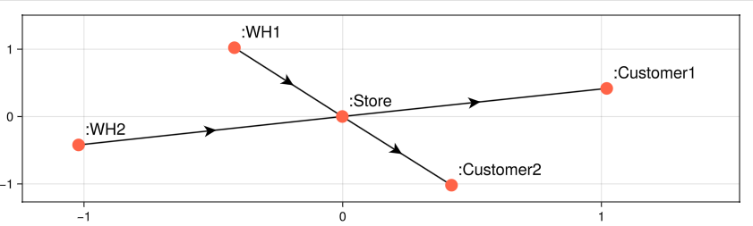

# SupplyChainModels

A package for graph-based supply chain modelling and simulation, with a focus on multi-echelon, multi-product systems.

## Usage

### Defining the supply chain topology

A supply chain is an instance of the `MetaGraph` type from [MetaGraphsNext.jl](https://juliagraphs.org/MetaGraphsNext.jl/stable/api/#MetaGraphsNext.MetaGraph).
```julia
SC = SupplyChain()
SC |> typeof |> fieldnames
# (:graph, :vertex_labels, :vertex_properties, :edge_data, :graph_data, :weight_function, :default_weight)
```

Naturally, the supply chain is empty at initialization:
```julia
SC.graph
#{0, 0} directed simple Int64 graph
SC.vertex_properties
#Dict{Symbol, Tuple{Int64, AbstractAgent}}()
SC.edge_data
#Dict{Tuple{Symbol, Symbol}, AbstractLink}()
```

Nodes (vertices) can be added using either the `@Node` macro for convenience, or using regular constructors:
```julia
SC[:WH1] = @Node Warehouse begin
    :ItemA => (stock=10_000,) # (initial stock for ItemA)
    :ItemB => (stock=10_000,)
end
SC[:WH2] = @Node Warehouse :ItemB => (stock=10_000,)
SC[:Store] = @Node Store begin
    :ItemA => (stock=450,)
    :ItemB => (stock=700,)
end
SC[:Customer1] = DemandNode() # (demand-only nodes)
SC[:Customer2] = DemandNode()
```

Links (edges) between nodes can be added using the `@Link` macro. Let's first add replenishment links between the two warehouses and the store:
```julia
SC[:WH1, :Store] = @Link ReplenishmentLink begin
    :ItemA => (R=EOQ(5.5, 250), SO=Backorder(), L=LeadTime(20))
end
SC[:WH2, :Store] = @Link ReplenishmentLink begin
    :ItemB => (R=EOQ(4.5, 250), SO=Backorder(), L=LeadTime(0))
end
```
where:
- `R=EOQ(5.5, 250)` is an EOQ replenishment policy with holding cost = `5.5` and ordering cost = `250`.
- `SO=Backorder()` is a simple backordering policy for stockouts.
- `L=LeadTime(20)` is a constant (replenishment) lead time of 10 time units and `LeadTime(0)` means immediate replenishment.
  - We can also use univariate distributions from `Distributions.jl`, e.g., `L=LeadTime(Normal(20))`.

Now let's add simple demand-only links to represent typical inventory consumption:
```julia
SC[:Store, :Customer1] = @Link DemandLink begin
    :ItemA => (D=Poisson(20), T=10, SO=Backorder(), L=LeadTime(0))
end
SC[:Store, :Customer2] = @Link DemandLink begin
    :ItemA => (D=Poisson(5), T=2, SO=Backorder(), L=LeadTime(0))
    :ItemB => (D=Poisson(20), T=2, SO=Backorder(), L=LeadTime(0))
end
```
where:
- `D=Poisson(20), T=10` means sampling demand from the `Poisson(20)` distribution every 10 time units (e.g., days).
- `SO=Backorder(), L=LeadTime(0)` work as in the previous block of code.

### Plotting the supply chain

Once defined, we can visualize the supply chain
```julia
using GLMakie, GraphMakie
scplot(SC, node_color=:tomato, layout=GraphMakie.Stress())
```



### Defining the simulation parameters and running the model

```julia
using Random
Random.seed!(1)

# Run the model for 365 days
sim = SimpleSimulator(SC, horizon=365)
run!(SC, sim)

# Results:
sim.INV
# 2×5×3 Array{Float64, 3}:
# [:, :, 1] =
#   8680.0     0.0  134.0  737.0   899.0
#  10000.0  6562.0  475.0    0.0  3663.0
# 
# [:, :, 2] =
#  0.0  0.0  0.0  0.0  0.0
#  0.0  0.0  0.0  0.0  0.0
# 
# [:, :, 3] =
#  0.0  0.0  0.0  0.0  0.0
#  0.0  0.0  0.0  0.0  0.0
```
where:
- `sim.INV[:,:,1]`, `sim.INV[:,:,2]` and `sim.INV[:,:,3]` represent the inventory on-hand, pipeline, and backlog respectively.
- Rows represent different items and columns represent different nodes.

## Plotting an EOQ model

```julia
using SupplyChainModels, GLMakie, GraphMakie

# SC
SC = SupplyChain()

# Nodes
SC[:WH] = @Node Warehouse :A => (stock=5000,)
SC[:Store] = @Node Store :A => (stock=0,)
SC[:Customer] = DemandNode()

# Links
SC[:WH, :Store] = @Link ReplenishmentLink begin
    :A => (R=EOQ(0.225, 8), SO=Backorder(), L=LeadTime(5))
end
SC[:Store, :Customer] = @Link DemandLink begin
    :A => (D=Poisson(20), T=2, SO=Backorder(), L=LeadTime(0))
end

# Simulation
sim = SimpleSimulator(SC, horizon=365)
function simrun!(SC::MetaGraph, sim::SimpleSimulator)

    fig = Figure()
    axs = [Axis(fig[i, 1]) for i in 1:3]

    # Observables
    WH_IOH = Observable(Point2f[(0, 0)])
    Store_IOH = Observable(Point2f[(0, 0)])
    Store_Pipeline = Observable(Point2f[(0, 0)])
    Customer_Backorders = Observable(Point2f[(0, 0)])

    # Lines
    lines!(axs[1], WH_IOH, label="WH IOH")
    lines!(axs[2], Store_IOH, label="Store IOH")
    lines!(axs[2], Store_Pipeline, label="Store Pipe")
    lines!(axs[3], Customer_Backorders, label="Cust Backorders")

    # Figure config
    limits!(axs[1], 0, sim.horizon, 0, 5000)
    limits!(axs[2], 0, sim.horizon, 0, 1000)
    limits!(axs[3], 0, sim.horizon, 0, 100)
    axislegend(axs[1])
    axislegend(axs[2], nbanks=2)
    axislegend(axs[3])
    display(fig)

    for t in 0:sim.horizon
        for (P, SO, L) in sim.policies
            P(t, sim.INV, SO, L)
        end

        WH_IOH[] = push!(WH_IOH[], Point2f(t, sim.INV[1, 1, 1]))
        Store_IOH[] = push!(Store_IOH[], Point2f(t, sim.INV[1, 2, 1]))
        Store_Pipeline[] = push!(Store_Pipeline[], Point2f(t, sim.INV[1, 2, 2]))
        Customer_Backorders[] = push!(Customer_Backorders[], Point2f(t, sim.INV[1, 3, 3]))

        sleep(2 * 1 / sim.horizon)
    end
end
simrun!(SC, sim)
```

https://github.com/user-attachments/assets/346adfa1-a5c5-4c4b-a573-f0f87887a7d9

## TODOs
- [ ] EOQ variations
- [ ] Classical continuous and periodic review models
- [ ] Interface for user-defined policies and demand patterns
- [ ] Transportation and fleet management module
- [ ] Production/Manufacturing module
- [ ] Integration with JuMP
